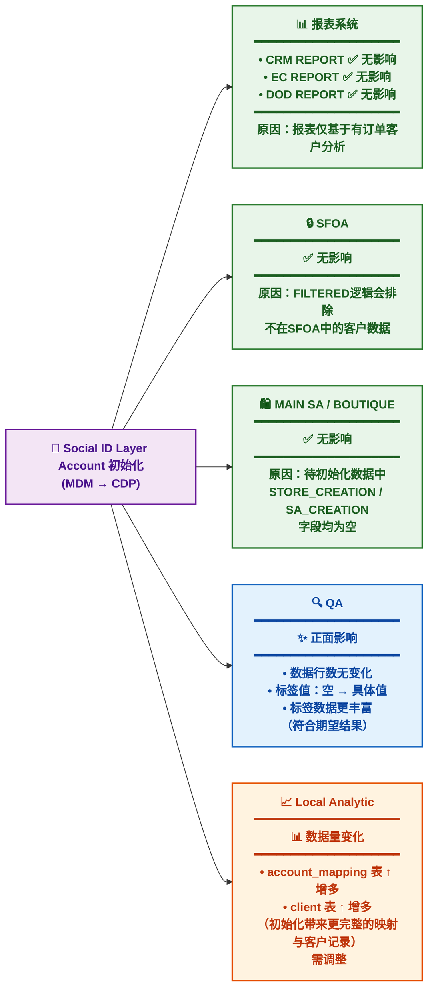
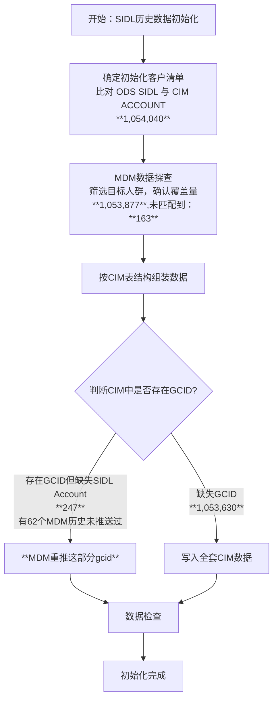
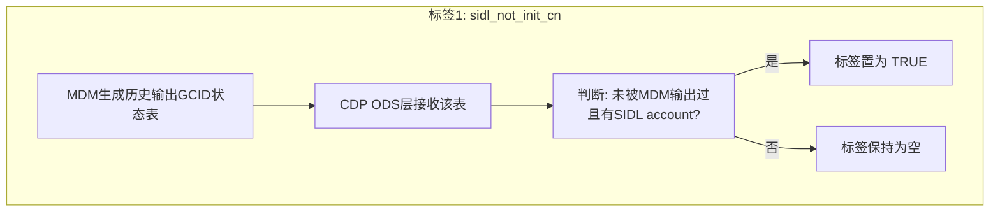
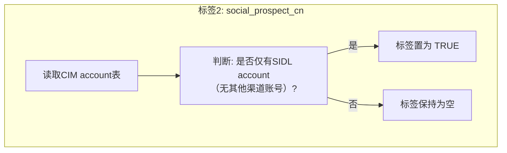

## 项目背景与目标

### 背景
- 此前 SIDL（社交身份层）历史数据初始化到 CIM 时，仅处理了约 **40 万**可与现有账号合并的 SIDL 账号，剩余 **120 万** social prospect 账号未同步到任何下游系统（图中 #1 部分）。
- 当时未同步的原因是这些 social prospect 尚无明确使用场景。
- 现在 CDP UC3 需要触达这部分 social prospect，但目前只能从 SIDL 手动筛选。为实现 UC3 人群圈选自动化（通过 QA 圈选后直接进入自动流），需要将这部分 social prospect 导入 QA。
### 讨论结论
- **仅导入 QA**：`#1` 账号只导入 QA，暂不同步至 SFOA 及报表。
- **新增标签 `sidl_not_init_cn`**：CDP 为这批账号打上该标签，取值为 `TRUE`；其他正常 GCID 为空。
- **数据字段约定**：对于 #1 账号，Segment、Friendly ID、Main SA/BTQ、销售相关标签均为空；`gc_id` 与 `union_id` 正常赋值；基本信息标签（birthday、gender 等）正常赋值；线上行为和算法相关标签正常赋值。
- **新增标签 `social_prospect_cn`**：取值为 `TRUE`，标记仅在社交渠道（SIDL 包含的渠道）注册的账号（即图中 #1 + #2 + #3）。非 social prospect 为空。

### 当前需要做的事
1. 完成 SIDL 初始化（将剩余 120 万 social prospect 按规则写入 CIM）。
2. CDP 中新增两个标签：`sidl_not_init_cn` 和 `social_prospect_cn`。

---
## 影响分析

![[Pasted image 20260512113343.png]]

- 关于Segment/segment_history：新增的客户信息，值为NO_SEGMENT
- 关于KPI: 所有KPI都是基于销售订单，因此，输出kpi的所有字段都为空
- 给到DSL 身份数据量增加
- 给到magento身份数据量增加
- 以下给到datamart的数据表数据量增加（不处理）：
	- ads_edp_client_computed_indicator_fact_v1_df
	- ads_dim_cust_cust_ww_ext_df
	- ads_dws_cust_tag_ww_df
	- ads_cust_segment_month_df
	- ads_dim_cust_cdpid_idmapping_output_df

ads_dim_cust_cust_ext_df
---
## 执行方案说明

### 一、完成 SIDL 历史数据初始化

#### 步骤
1. **确定初始化客户清单**  
   比对 CDP `ods_sidl_customer_df` 表与 CIM ACCOUNT 表，找出在 SIDL 中存在但在 CIM ACCOUNT 中不存在的客户。

2. **MDM 数据探查**
   在 MDM 中筛选这部分人群，确认可覆盖客户量及未被覆盖客户量（应为 0 或少量）。

3. **组装数据**  
   - 按 CIM 的表结构组装待写入数据。
   - 使用gold数据

5. **数据写入（分两类）**  
   - **CIM 中有对应 GCID，但缺失 SIDL ACCOUNT**：按对应 CIM event date，仅写入 SIDL Account。或者由MDM重新推送。 
   - **CIM 中缺失 GCID**：
	   - 方案一：写入全套 CIM 数据（包括 Account 及其他必要字段）。
	   - 方案二：手动调整MDM常规写入CDP consumer表中的is_delta字段值，将这部分客档is_delta置为1，手动调度下游实例，写入CDP

5. **数据检查**  
   完成初始化后验证数据一致性。

#### 流程图

![[Pasted image 20260512113431.png]]

### 二、CDP 中新增两个标签

#### 1. 标签 `sidl_not_init_cn`
- **含义**：标记 SIDL 是否未被 MDM 输出过（正常链路输出至 COR CN）。本次初始化的数据不在输出范围内。
- **取值**：`True` 或空。
- **生成逻辑**：
  1. MDM 生成历史输出 GCID 状态表。
  2. CDP ODS 层接收该数据表。
  3. 基于该表判断：未被 MDM 输出过、但有 SIDL account 的 GCID，将其标签置为 `True`。

#### 2. 标签 `social_prospect_cn`
- **含义**：标记是否仅有 SIDL account（即仅在社交渠道注册，包括 `#1` `#2` `#3`）。
- **取值**：`True` 或空。
- **生成逻辑**：
  - 根据 CIM account 表判断：如果某个 GCID 仅有 SIDL account（无其他渠道账号），则置为 `True`。

#### 流程图

